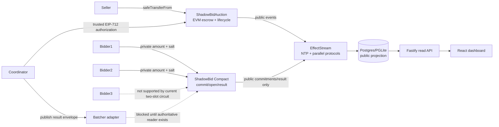
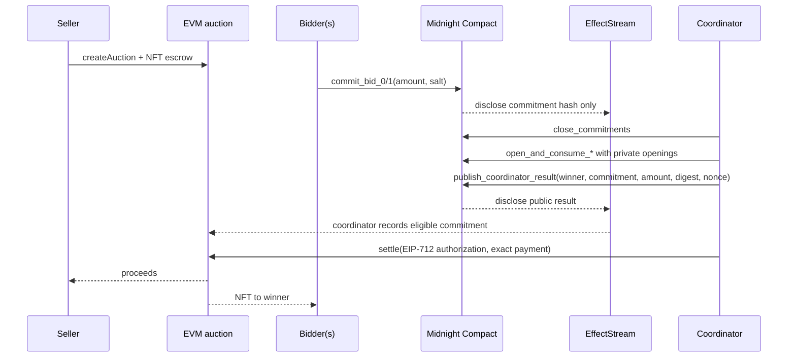

# ShadowBid

> Bid without showing your hand.

ShadowBid is a cross-chain sealed-bid NFT auction prototype. The ERC-721 asset is escrowed on EVM; bid commitments and openings are handled by a Compact circuit on Midnight; EffectStream joins the public facts into an auditable read model. The public projection never stores salts, openings, losing amounts, or private bid values.

This repository contains a real contract, Compact circuit, EffectStream primitives/state machine, database/API, batcher adapter, frontend read dashboard, and tests. It is not yet a complete click-through auction product: the frontend write flow is disabled, the local orchestrator deploys the legacy `contract-round-value` for its generic Midnight example, the ShadowBid Midnight deployment is not selected by the sync config, and the development batcher intentionally fails closed until an authoritative finalized-state reader is supplied.

## Pitch and problem

Open NFT auctions expose bids before the auction is decided, enabling copy-trading, anchoring, and strategic collusion. ShadowBid separates public ownership and settlement from private bid openings: participants publish commitments, then a trusted coordinator publishes an authorized result after commitments close.

## Why these technologies

- **EVM:** ERC-721 custody, public auction lifecycle, commitment records, EIP-712 settlement authorization, payment, and final NFT transfer.
- **Midnight:** Compact `persistentCommit` binds the bid domain, bidder, amount, and salt; opening circuits verify the bidder’s own commitment; only selected result fields are disclosed.
- **EffectStream:** NTP ordering plus parallel EVM/Midnight ingestion, append-only source facts, replay-safe reduction, Postgres materialization, and a read API. EffectStream is an index/projection here, not a proof verifier or settlement authority.

## Architecture



### Sealed-bid sequence



## What is public and private

| Surface | Public | Private/not retained by projection |
| --- | --- | --- |
| EVM contract | seller, NFT, token, deadlines, reserve, commitment hashes, winner, settlement amount after settlement, events | bid amount/salt before settlement; losing openings |
| Midnight ledger | auction domain, lifecycle flags, commitment hashes, nullifiers, selected published result | commitment salt and opening inputs while supplied to circuits; losing bid openings |
| EffectStream/API/database | source identity, lifecycle, counts, commitments, final result fields | no `salt`, opening, losing amount, or private bid columns |
| Frontend | read-only auction cards, phases, counts, hidden reserve/amount labels | no write transaction or proof; “Start private bid flow” is demo state only |

## Trust assumptions and limitations

The current EVM contract explicitly trusts `settlementSigner`; it does not verify a Midnight proof or inspect Midnight state. The coordinator/result authority must therefore be honest and correctly configured. EIP-712 binds settlement to chain, verifying contract, auction, winner, amount, commitment, Midnight domain/network, result version, expiry, and nonce. The batcher validates canonical envelopes, authoritative readiness, matching commitments/results, and durable replay keys, but the dev reader returns `null`, so settlement requests are rejected by default.

The current Compact source has `commit_bid_0` and `commit_bid_1` only. The existing contract test asserts a third slot and therefore currently exposes a known failing/incomplete requirement; do not claim three private bidders are supported. The dashboard can display indexed auctions but cannot create auctions, submit bids, close commitments, prove openings, or settle. Local deployment also needs wiring from `contract-shadowbid` into `start.dev.ts`/`config.dev.ts` before an end-to-end ShadowBid run is available.

## Setup, build, test, and demo

Validated reference-stack commands on the recorded machine are:

```sh
bun install --frozen-lockfile
bun run build:midnight
bun run build:evm
bun run --cwd packages/frontend build
bun run test
bun run dev
```

Use Compact `0.33.0-rc.2` with the coupled prerelease set recorded in [`docs/SETUP_STATUS.md`](docs/SETUP_STATUS.md). If the manager cannot resolve it, follow the archived-build install and SHA-256 check there. `bun run dev` serves the dashboard at [http://127.0.0.1:10599](http://127.0.0.1:10599); read APIs are at [http://127.0.0.1:9999/api/auctions](http://127.0.0.1:9999/api/auctions), [http://127.0.0.1:9999/api/shadowbid/service-state](http://127.0.0.1:9999/api/shadowbid/service-state), and [http://127.0.0.1:9999/api/auctions/1](http://127.0.0.1:9999/api/auctions/1) when auction `1` exists. The sync API health endpoint is `/health`.

For a truthful demo, use the read-only dashboard to show the public projection and then show the contract/circuit/unit-test evidence described in [`docs/DEMO.md`](docs/DEMO.md). There is no supported UI action that creates three bids or completes settlement.

## Directory map

```text
packages/contracts-evm/                 Solidity escrow + Foundry tests
packages/contracts-midnight/contract-shadowbid/  Compact circuit + privacy test
packages/node/shadowbid*.ts             facts, primitives, reducer, STM wiring
packages/database/                      migrations and typed ShadowBid queries
packages/batcher/shadowbid-settlement.ts strict envelope/replay/readiness adapter
packages/frontend/client/               read dashboard and explicit disabled writes
packages/tests/                         infra, projection, privacy, cross-chain, UI tests
docs/                                   architecture, security, demo, readiness, handoff
```

## Security posture

The strongest implemented properties are commitment-domain binding, EIP-712 authorization, exact-payment/winner checks, escrow-only receiver validation, reentrancy protection, expiry/nonce/replay checks, append-only source facts, and privacy-oriented API/database/log tests. See [`docs/SECURITY.md`](docs/SECURITY.md), [`docs/PRIVACY.md`](docs/PRIVACY.md), and [`docs/SECURITY_REVIEW.md`](docs/SECURITY_REVIEW.md). This is a prototype; do not use mainnet keys or treat the coordinator as trustless.

## Future work and hackathon fit

Next steps are to add a third bid slot or generalize the Compact ledger, wire the deployed ShadowBid contract into the local sync stack, implement wallet-backed create/commit/close/open/settle actions, replace the fail-closed reader with finalized EVM+Midnight/result-authority reads, and add a complete happy-path integration test. ShadowBid fits a Midnight track because the core user value is private bid openings with selectively public outcomes, while EVM supplies familiar NFT custody and EffectStream demonstrates a usable cross-chain state layer.

See [`docs/SUBMISSION_READY.md`](docs/SUBMISSION_READY.md) for the truthful submission checklist. No external submission is implied by this repository.
