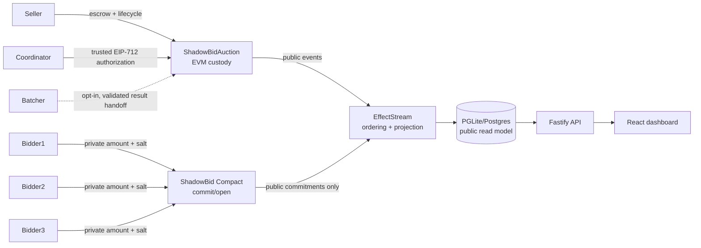

# ShadowBid

> Bid without showing your hand.

ShadowBid is a cross-chain sealed-bid NFT auction reference prototype. The ERC-721 is escrowed on EVM, bid commitments and private openings are handled by a Compact circuit on Midnight, and EffectStream joins public facts into a deterministic read model. The public projection never stores salts, openings, losing amounts, or private bid values.

## Current status and scope

The current validated checkout includes the Solidity auction contract, an eight-circuit Compact contract with three fixed bidder slots, EffectStream primitives/reducer/database/API, a live Midnight public-ledger reader, an authenticated trusted-coordinator CLI, a fail-closed batcher adapter, and a polished read-only dashboard.

It is not a trustless or proof-backed auction. The Compact circuit verifies individual commitment/opening operations but does not compare bids or compute the maximum. EVM verifies an EIP-712 authorization from the configured `settlementSigner`; it does **not** directly verify a Midnight ZK winner-computation proof. The coordinator is therefore a trust assumption. The UI does not currently submit create-auction, bid, close, opening, or settlement transactions.

A real 8/13/11 three-bidder run **has** been executed and recorded — see the evidence table in [`docs/TEST_MATRIX.md`](docs/TEST_MATRIX.md). Three bid values stayed private inputs to real ZK circuits, only commitment hashes and lifecycle flags became public, and a coordinator-authorized settlement transferred the NFT to the stated winner. That run does **not** establish that the winning bid was the highest: the harness selected the winner, Compact never compared the three amounts, and a dishonest coordinator could have signed for a different committed bidder with every check in this system still passing. The three commitments were also submitted through one local development wallet, not three independently funded Midnight wallets.

## Architecture



The four boundaries are:

1. `ShadowBidAuction.sol` escrows the NFT, records public commitment hashes, and enforces deadline, reserve, payment, winner, domain, nonce, expiry, replay, and signer checks.
2. `shadowbid.compact` binds protocol version, EVM chain, auction, Midnight network/contract, bidder, amount, and salt into `persistentCommit<Bid>`. It has slots `0`, `1`, and `2`; no result-publication circuit exists.
3. EffectStream ingests EVM and Midnight observations, orders and reduces append-only facts, and materializes public auction state. It is a deterministic indexing/read-model layer, not a trustless bridge, proof verifier, or settlement authority.
4. The coordinator CLI validates a decision against public Midnight ledger state and signs the EIP-712 result. The batcher can consume that result when explicitly configured; it fails closed by default.

## Public and private data

| Surface | Public | Private/not retained by projection |
| --- | --- | --- |
| EVM | seller, NFT, deadlines, reserve, commitment hashes, and final winner/amount after settlement | bid amount/salt before settlement; losing openings |
| Midnight | auction domain, lifecycle flags, commitment hashes, and nullifiers | salt and opening inputs supplied as private circuit witnesses; losing openings |
| EffectStream/API/database | source identity, lifecycle, counts, commitment hashes, and final EVM result fields if settled | no salt, opening, losing amount, or private-bid columns |
| Frontend | public auction cards, phases, counts, and final public result | no private bid values, openings, or proof witness data |

Addresses, timing, transaction identity, counts, hashes, and nullifiers remain observable metadata. Winner identity and winning amount become public when the EVM settlement event is emitted. Losing bids remain outside public ledger events, EffectStream state, APIs, database rows, browser output, and application logs covered by the privacy checks.

## Trust and security model

The EVM contract trusts `settlementSigner`. Its signature proves who authorized a result, not that the result is the mathematically highest bid. The live reader checks the signed domain, auction, commitment, and closed public Midnight state; it never treats the EffectStream projection or API as settlement authority. The coordinator still decides winner/amount out-of-band and requires a separate operational security review before production use.

The local stack uses Compact `0.33.0-rc.2` with its coupled prerelease SDK/runtime set. The default ShadowBid compile generates real proving/verifier keys; `compact:skip-zk` is an explicit fallback only for environments that cannot run the key-generation subprocess. See [`docs/PRIVACY.md`](docs/PRIVACY.md), [`docs/SECURITY.md`](docs/SECURITY.md), and [`docs/SECURITY_REVIEW.md`](docs/SECURITY_REVIEW.md).

## Setup, test, and launch

From this directory:

```sh
bun install --frozen-lockfile
bun run build:midnight
bun run build:evm
bun run --cwd packages/frontend build
bun run test
bun run dev
```

The final validated run reports 42/42 orchestrated checks, 45/45 focused batcher/node checks, 8/8 Forge checks, 4/4 Compact checks, and 6/6 independent browser smoke checks. The exact machine, versions, endpoints, warnings, and persistent-stack evidence are recorded in [`docs/SETUP_STATUS.md`](docs/SETUP_STATUS.md) and [`docs/TEST_MATRIX.md`](docs/TEST_MATRIX.md).

The exact launch command is `bun run dev`. The frontend is [http://127.0.0.1:10599/](http://127.0.0.1:10599/); the EffectStream API is at `http://127.0.0.1:9999`, and the batcher is at `http://127.0.0.1:3334`. See [`docs/TROUBLESHOOTING.md`](docs/TROUBLESHOOTING.md) for service ports and optional coordinator configuration.

## Coordinator handoff (opt-in)

The one-shot reference CLI takes an operator-supplied decision file, validates it against the live Midnight public ledger, signs it with `SHADOWBID_COORDINATOR_PRIVATE_KEY`, and writes an atomic result file. It does not read private Compact witnesses or compute a maximum. Its usage and JSON shape are documented in [`docs/DEMO.md`](docs/DEMO.md) and `packages/batcher/shadowbid-coordinator-cli.ts`.

Both batcher entrypoints remain fail-closed unless all required coordinator/result-reader environment variables are set. This opt-in path is authenticated but trusted; it is not a proof-backed bridge.

## Repository map

```text
packages/contracts-evm/                          Solidity escrow + Foundry tests
packages/contracts-midnight/contract-shadowbid/  Compact circuit + privacy test
packages/node/shadowbid*.ts                     facts, primitive, reducer, STM wiring
packages/database/                              migrations and typed ShadowBid queries
packages/batcher/shadowbid-*.ts                 reader, coordinator, settlement adapter
packages/frontend/client/                       read dashboard and wallet shell
packages/tests/                                 infrastructure, projection, privacy, UI tests
docs/                                           architecture, security, demo, submission docs
```

## Judge demo and honest limitations

Use [`docs/DEMO.md`](docs/DEMO.md) for the deterministic two-minute read-only/source-backed demo. The requested seller → A=8 → B=13 → C=11 → close → private winner derivation → settlement sequence is a **pending integration target**, not an executable UI path in this checkout. Do not present a fabricated transaction or claim that Midnight computed the winner.

Future work is proof-backed winner selection with deterministic tie rules and EVM-address binding, authenticated/timed Compact lifecycle transitions, scalable bidder storage, wallet-backed writes, and a proof-capable three-bidder integration run. See [`docs/SUBMISSION_READY.md`](docs/SUBMISSION_READY.md).
