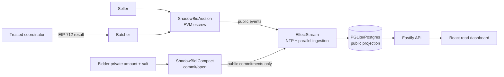

# ShadowBid architecture

> Current status: validated reference implementation with a trusted coordinator; not a trustless bridge or proof-backed auction.

## Boundaries

1. **EVM custody and settlement.** `ShadowBidAuction.sol` escrows the ERC-721, records public commitment hashes, and enforces the commit/settlement windows, reserve, exact payment, winner, EIP-712 domain, expiry, nonce, replay, and configured `settlementSigner` checks.
2. **Midnight privacy circuits.** `shadowbid.compact` uses `persistentCommit<Bid>` over the protocol version, EVM chain, auction, Midnight network/contract, bidder, amount, and salt. It has three fixed slots (`0`, `1`, `2`) and eight circuits. Amount and salt are private circuit inputs; no result-publication circuit exists.
3. **EffectStream projection.** `shadowbid-primitive.ts` turns EVM events and Midnight public observations into immutable facts. `state-machine.ts` reduces them deterministically into the public auction/commitment tables. EffectStream is the deterministic multi-chain ordering/indexing/read-model layer; it is not a trustless bridge, proof verifier, or settlement authority.
4. **Coordinator and batcher.** The one-shot coordinator CLI validates a supplied decision against public Midnight ledger state, signs the EIP-712 result, and writes an atomic handoff file. The batcher consumes it only when explicitly configured with the required environment variables and otherwise fails closed.
5. **API and UI.** Fastify exposes read-only public projection state. React renders the dashboard, auction detail, status, and privacy model. Wallet-backed create/bid/close/open/settle writes are not exposed in the current checkout.

## Data flow

## Settlement semantics

The live Midnight reader checks public ledger registration, closure, commitment membership, and domain consistency before a signed result can reach `SETTLEMENT_READY`. It never trusts the EffectStream/API projection as authority. The coordinator still chooses winner and amount out-of-band; EIP-712 authenticates the signer and binds the result, but does not prove that the winner is the maximum bid. EVM does **not** directly verify a Midnight ZK winner-computation proof.

The requested interactive seller → 8/13/11 bids → close → result → settlement path remains a pending integration target. The current test evidence covers component boundaries and authenticated handoff, not a recorded private-bid-to-final-NFT end-to-end run.

## Reproducibility

Use `bun run dev` from the template directory. Service ports and exact validation evidence are in [`SETUP_STATUS.md`](SETUP_STATUS.md); test evidence is in [`TEST_MATRIX.md`](TEST_MATRIX.md).
